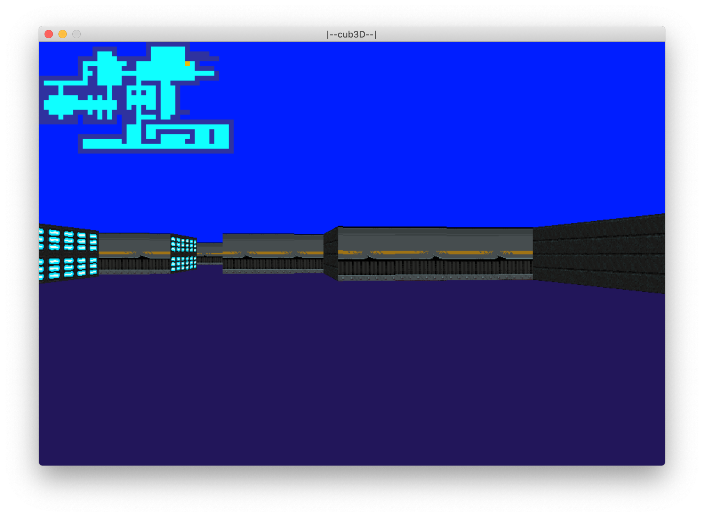

<h1 align="center">Cub3D</h1>

	

	

    

## mrhyhorn and sshield group 👩🏻‍💻 🧑🏻‍💻 at School21

## Content

[Summary](https://github.com/D-Dashka/cub3D#-summary)

[Game](https://github.com/D-Dashka/cub3D#-game)

[How to run](https://github.com/D-Dashka/cub3D#-how-to-run)

[Useful links and sources](https://github.com/D-Dashka/cub3D#-useful-links-and-sources)

## 📄 Summary

Graphic project with use of miniLibX.

This project is inspired by the world-famous Wolfenstein 3D game. It aims to explore ray-casting. The goal is to make a dynamic view inside a maze, in which the player has to find the way.

## 🎮 Game

• The ***left*** and ***right*** arrow keys of the keyboard allow to look left and right in the maze.

• The ***W, A, S, D*** keys allow to move the point of view through the maze.

• Pressing ***ESC*** and ***red cross*** of window close the window and quit the program.

### Map

All maps are stored in <code>maps</code> directory

The map itself is composed of 6 characters:

- `0` for an empty space
- `1` for a wall
- `N`,`S`,`E` or `W` for the player’s start position and spawning orientation

*You can create your own map using the combination of characters mentioned above.*

#### Map rules

- Map should be surrounded by wall and must not have empty lines.

To validate the map we used `flood-fill algorithm`

### Minimap

• The minimap is displayed in the top left corner with player moving as you press the keys.

### Game preview

	

## 🏁 How to run

The project can be compiled on both Mac OS and Linux.

	make && ./cub3D maps/choose_your_map

### Example

	make && ./cub3D maps/irregular.cub

or

	./cub3D maps/lab.cub

## 🔗 Useful links and sources

 Raycasting 

🌐 [Lode's Computer Graphics Tutorial - Raycasting](https://lodev.org/cgtutor/raycasting.html)

🌐 [Обучение технологии ray-casting, часть 1](https://habr.com/ru/post/515256/)

🌐 [permadi.com - Raycasting tutorial](https://permadi.com/1996/05/ray-casting-tutorial-2/)

▶️ [Make Your Own Raycaster Part 1](https://www.youtube.com/watch?v=gYRrGTC7GtA)

 Movements 

▶️ [Rotation matrice](https://www.youtube.com/watch?v=OYuoPTRVzxY)

🌐 [Custom frame rate counter](https://stackoverflow.com/questions/87304/calculating-frames-per-second-in-a-game/7796547#7796547)

 Map validation 

🌐 [How can I tell if an object in a tile grid is surrounded?](https://gamedev.stackexchange.com/questions/89857/how-can-i-tell-if-an-object-in-a-tile-grid-is-surrounded)

🌐 [Flood fill algorithm](https://www.freecodecamp.org/news/flood-fill-algorithm-explained/#:~:text=Flood%20fill%20is%20an%20algorithm,re%20gonna%20talk%20about%20next.)

🌐 [Convert hex string to int](https://stackoverflow.com/questions/10156409/convert-hex-string-char-to-int)

 Textures 

🌐 [OpenGameArt.org](https://opengameart.org/content/tiny-texture-pack-1?page=5)

🌐 [Free Texture Pack for Realtime 3D](https://www.geeks3d.com/20081226/free-texture-pack-for-realtime-3d/)

🌐 [itchio.io](https://itch.io/game-assets/free/tag-textures)

